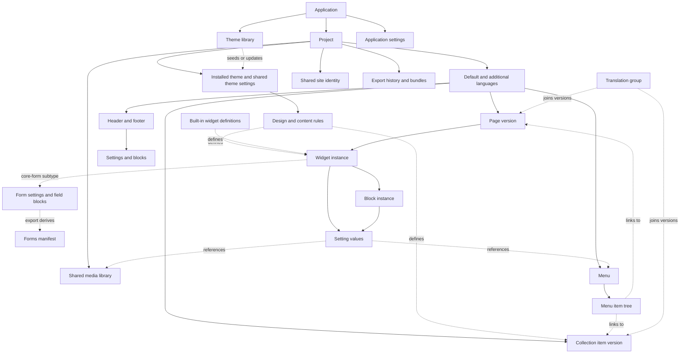

# How Widgetizer behaves

Start here when asking **what exists, what owns it, and what else changes when I do something**.

Every entity and workflow page starts with a **plain-language guide**: what it means, what you can do, what else changes, and when the result is saved. You can read those guides without opening code. Stop at **Technical details** unless you want implementation and test evidence.

Updated 2026-09-20 against the completed R1–R8 review and real-project checks recorded through `f10e20ce`. This folder describes current behaviour, boundaries and evidence. It is not a task queue. Built-in widgets and forms have their own guides, including core form localization (`22a93fa5`).

## A reading route through the app

Start with a [project](entities/project.md), then look inside one [page](entities/page.md), one [widget](entities/widget.md) and one [block](entities/block.md), then the [built-in widgets](entities/core-widget.md) and [form rules](entities/form.md). Next, read about the [shared header/footer](entities/global-widget.md), [menus](entities/menu.md), [collections](entities/collection.md) and [media library](entities/media.md). Finish with [languages](multilingual.md) and the [operation walkthroughs](operations/README.md).

For a quick distinction that applies throughout: **editing changes your working view; saving keeps the work; exporting makes website files; deploying those files changes the website visitors see.** Some actions, such as uploading a file or deleting a page, save their result immediately when that operation succeeds.

## Choose a way in

| I want to understand… | Start here |
| --- | --- |
| The objects and their relationships | [Entity directory](#entity-directory) |
| What happens when I create, import, duplicate, or delete something | [Operation directory](operations/README.md) |
| What is shared and what changes with language | [Multilingual rules](multilingual.md) |
| Which expectations have test evidence | [Coverage map](coverage.md) |
| What an embedding app must preserve | [Integration contracts](operations/integration.md) |
| Where the code lives | [Architecture](../core-architecture.md) and [package contracts](../core-packages.md) |

## The relationship map

Solid arrows mean “contains”; dotted arrows mean “uses” or “defines.” A project keeps its language versions together. A translation group simply records which pages or entries are versions of the same thing.

This is an orientation diagram, not every possible edge. Media can also be referenced by page SEO, collection settings/SEO, globals, theme settings, richtext, and the site-identity logo. [Media](entities/media.md) and [settings and references](entities/settings.md) describe those relationships.

## Entity directory

| Entity | What it is | Language behavior |
| --- | --- | --- |
| [Project](entities/project.md) | One website and everything you need to edit it | Keeps all its languages and shared resources together |
| [Language and translation group](entities/language.md) | A site language, and the relationship between equivalent pages or entries | Versions stay independently editable |
| [Page](entities/page.md) | A destination such as Home, About or Contact | Each version has its own content, address and sharing details |
| [Widget](entities/widget.md) | A page section, such as a gallery or testimonials | Belongs to that page version |
| [Built-in widgets](entities/core-widget.md) | App-supplied Spacer, Divider and Form | Instances belong to their page version |
| [Form and field](entities/form.md) | A form widget, its input blocks and generated submission definition | Additional-language forms have separate exported identities |
| [Block](entities/block.md) | A piece inside a widget, such as one testimonial | Belongs to the section you are editing |
| [Header and footer](entities/global-widget.md) | Shared top and bottom sections | Shared by pages in that language |
| [Setting and reference](entities/settings.md) | An editable value, or a selection such as a photograph or destination page | Depends on what contains the setting |
| [Menu and menu item](entities/menu.md) | A navigation list and the choices inside it | Each language has its own navigation choices |
| [Collection type and item](entities/collection.md) | A group such as News, and one entry such as an article | Shared field definitions; independent translated entries |
| [Media, rendition, metadata, usage](entities/media.md) | Uploaded files, generated image sizes, descriptions and places they are used | Shared files; optional translated descriptions |
| [Theme, schema, template, preset](entities/theme.md) | The design tools, content rules and starting designs | Design rules and shared appearance apply across languages |
| [Preview, export, generated page](entities/output.md) | Views and website files made from your work | Must show the intended language's content |
| [Application settings and editor session](entities/session.md) | Your app preferences and current editing work | Interface language and website language are separate |

## A concrete example

The English About page and its Greek version are related but separately editable. Each can have its own text, section order, photographs, web address and search description. Editing a Greek block does not update the English block. Both pages can use the same uploaded photograph with different descriptions. Greek pages use their Greek shared header; saving a change to it affects the pages that use it.

## How to read and maintain this map

- **Current behavior** describes a traced code path. It does not automatically endorse that behavior as the desired product rule.
- **Known limitation** describes a current boundary; it is not an instruction to build a feature or a release requirement. Keep planned work outside this folder.
- **Test evidence** names existing suites and, where inspected, specific cases. A suite's existence is not complete coverage. See the [coverage legend](coverage.md#evidence-levels).
- Keep rules in the entity or multilingual page; operation pages describe their consequences. Link instead of copying the same rule into every workflow.
- Keep the plain-language guide and technical details in agreement. Explain consequences in ordinary words first; code names and storage formats belong below the technical boundary. Do not turn behavior still under review into a product promise.
- When a behavior changes, update its entity, operation, and coverage row together. Add a new entity or operation here before it becomes invisible to the map.
- For a new operation, record its preconditions, identity changes, content writes, reference/usage effects, language scope, failure/retry behavior, and test evidence.

Scope: application domain objects, supported user workflows, derived artifacts, and important session state. Individual buttons, CSS components, database columns, and every helper function are not separate domain entities. The [API inventory](operations/api-index.md) makes the backend surface discoverable; editor-only operations are indexed separately.

## Coverage boundaries

The main domain families are mapped: project/site identity, languages/groups, pages, widget/block instances (including all three built-ins), globals, settings/references, menus, collections, media/usage, theme definitions/visitor strings, output and session state. Forms previously appeared only as ordinary widget content and export metadata; their identity, validation and submission boundary now have dedicated pages.

This is not an exhaustive specification of every theme widget or every interaction. Theme widgets use the common widget/block/schema model; specialized behavior such as listings and forms gets its own explanation. Integration registries and Electron updates remain in their subsystem references. External form submissions are outside this repository's domain. The [coverage map](coverage.md) preserves unverified combinations rather than treating a complete entity inventory as complete test coverage.

## Inspection history

**Evidence baseline: `f10e20ce` — 2026-09-20.** Review scope and method limits are recorded in coverage; no claim of exhaustive verification is made.

| Pass | Commits included | What was reviewed |
| --- | --- | --- |
| Initial map | `6500c601`, then `cb81f267` | Domain and operation inventory; language-qualified previews |
| Plain-language guides | Through `a0f7c545` | Everyday explanations; rendered language and language-switch destinations |
| Export and listings update | `0d4815ba`, `1775a245` | Export eligibility, translated output/SEO/forms, language-specific listings and pagination; affected source and new test assertions |
| Completed domain review | R1–R8; documentation through `f10e20ce` | Media safety, deletion references, language lifecycle, write rules, theme references, structural failures, export and backup/clone; two real-project walkthroughs |
| Built-ins and forms | Through `22a93fa5` (2026-09-19) | Full built-in/form inventory; core English/Greek form dictionaries, theme overrides, runtime versus stored defaults, catalog-to-export parity |

The completed reviews, reported full-suite results and both hands-on walkthroughs are recorded in [validation details](coverage.md#latest-validation). The initial export/listings pass above was narrower; it is retained as inspection history, not current pending work.
