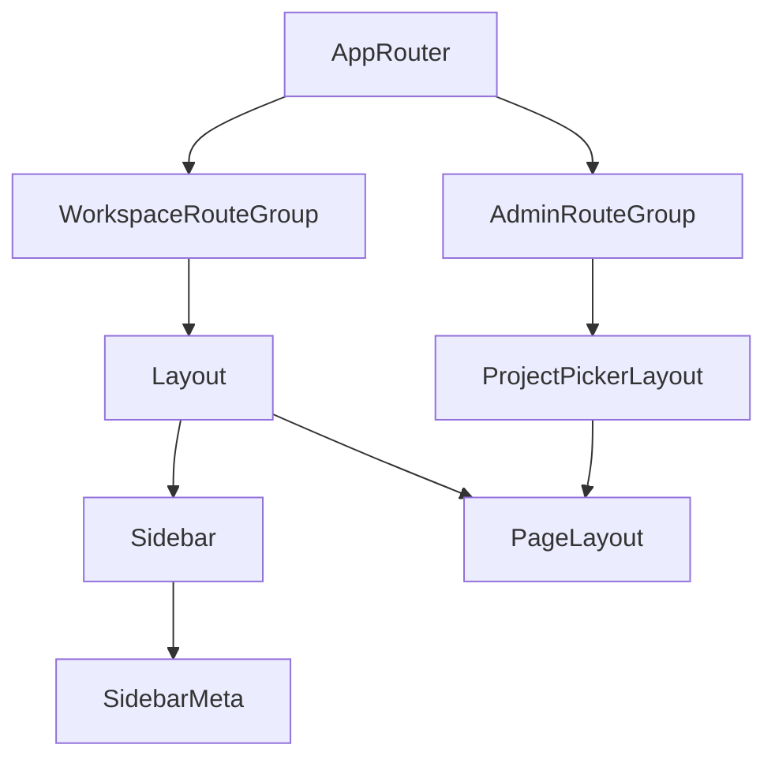

# Global Shell Simplification Plan

## Goal
Reduce shell-level drift without over-abstracting the layout system.

This pass should improve consistency across the global app structure:
- workspace shell
- project/admin shell
- sidebar framing
- page-level spacing ownership

The plan intentionally favors small, high-value changes over introducing new generic shell abstractions.

## Scope
In scope:
- top-level routing shells
- sidebar structure
- shell spacing consistency
- page shell vs page content spacing ownership

Out of scope:
- individual page internals
- table/form redesigns
- widget/page editor internals
- introducing a generic shared shell component unless later justified

## Final Position
The original idea of a reusable shared shell frame is not wrong in principle, but it is not the right move yet.

`Layout.jsx` and `ProjectPickerLayout.jsx` are still small, and the duplicated structure is limited. Extracting a generic shell wrapper now would likely add more indirection than value, especially because the workspace shell has special cases like the sidebar, update banner, and `page-editor` behavior.

The better direction is:
- keep the two layout components separate
- simplify routing where there is obvious duplication
- extract sidebar metadata because it is a clean separation
- use lightweight shared metrics for spacing/radius values
- clean up `PageLayout` so shell spacing ownership is clearer

## Main Problems To Fix
- `ProjectPickerLayout` is mounted multiple times in [src/App.jsx](src/App.jsx) for the same shell pattern.
- The sidebar metadata block is bundled into [src/components/layout/Sidebar.jsx](src/components/layout/Sidebar.jsx) even though it is not part of navigation.
- Shell metrics like inset, radius, and sidebar width are repeated as literals.
- [src/components/layout/PageLayout.jsx](src/components/layout/PageLayout.jsx) adds outer spacing on top of shell spacing, creating double-padding and weaker rhythm.

## Recommended Approach

### 1. Consolidate admin/project shell routes
Refactor [src/App.jsx](src/App.jsx) so the admin-style routes share one `ProjectPickerLayout` parent instead of mounting the same shell three times.

Target route group:
- `/projects`
- `/projects/add`
- `/projects/edit/:id`
- `/themes`
- `/app-settings`

Why this is worth doing:
- removes clear structural duplication
- makes the route tree easier to reason about
- keeps the shell relationship explicit without introducing a new abstraction layer

### 2. Split sidebar metadata from navigation
Extract the version/docs/changelog block from [src/components/layout/Sidebar.jsx](src/components/layout/Sidebar.jsx) into a small dedicated component.

Why this is worth doing:
- narrows `Sidebar.jsx` to navigation concerns
- makes footer/meta content easier to maintain separately
- creates a cleaner seam if sidebar structure changes later

### 3. Add lightweight shared shell metrics
Introduce a minimal shared source for shell values used across layouts, but avoid a heavyweight config abstraction.

Good candidates:
- shell inset
- frame radius
- sidebar width
- logo width

Preferred implementation options:
- CSS custom properties
- lightweight Tailwind theme tokens

Avoid:
- a dedicated layout config module with unnecessary indirection
- a generic shell system built around those values

### 4. Clarify spacing ownership with `PageLayout`
Adjust [src/components/layout/PageLayout.jsx](src/components/layout/PageLayout.jsx) so it does not duplicate outer shell padding.

Rule of ownership:
- shell owns outer page spacing
- `PageLayout` owns page header, actions, and inner card/content structure

This is a small cleanup item, not a major architectural phase.

## Explicit Non-Goal
Do not extract a `SharedShellFrame` component in this pass.

Reason:
- the current layouts are still small
- duplication exists, but is limited
- a generic wrapper would likely accumulate exceptions for:
  - sidebar vs no-sidebar
  - update banner handling
  - `page-editor` full-bleed mode
  - header composition differences

If shell complexity grows later, that extraction can be reconsidered from a stronger position.

## Key Files
- [src/App.jsx](src/App.jsx)
- [src/components/layout/Layout.jsx](src/components/layout/Layout.jsx)
- [src/components/layout/ProjectPickerLayout.jsx](src/components/layout/ProjectPickerLayout.jsx)
- [src/components/layout/PageLayout.jsx](src/components/layout/PageLayout.jsx)
- [src/components/layout/Sidebar.jsx](src/components/layout/Sidebar.jsx)

## Expected Outcome
- The route structure becomes simpler and easier to follow.
- Sidebar responsibilities are cleaner.
- Shell spacing becomes easier to keep consistent.
- The codebase avoids premature abstraction while still reducing the most obvious duplication.

## Architecture Sketch

## Implementation Order
1. Consolidate admin shell routes in [src/App.jsx](src/App.jsx)
2. Split sidebar metadata block from [src/components/layout/Sidebar.jsx](src/components/layout/Sidebar.jsx)
3. Add lightweight shared shell metrics for repeated values
4. Remove double-padding by simplifying [src/components/layout/PageLayout.jsx](src/components/layout/PageLayout.jsx)

## Notes
- This is a calibration pass, not a broad shell rewrite.
- The plan prefers readability and local simplicity over maximum deduplication.
- If future changes make `Layout.jsx` and `ProjectPickerLayout.jsx` materially larger, revisit a shared shell primitive then.
