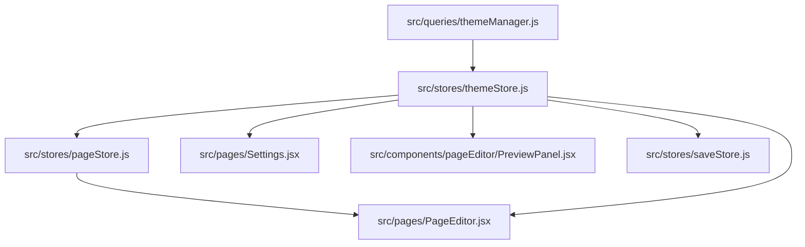

# Theme Settings Unification Plan

## Goal
Make one dedicated shared theme-settings store the main owner of per-project theme settings across the app, instead of splitting ownership between local state in [src/pages/Settings.jsx](src/pages/Settings.jsx), editor state in [src/stores/pageStore.js](src/stores/pageStore.js), and the partially unused [src/stores/themeStore.js](src/stores/themeStore.js).

## Current Constraints To Preserve
- The editor preview pipeline expects the existing theme-settings payload shape from [src/queries/themeManager.js](src/queries/themeManager.js).
- The editor currently includes theme settings in undo/redo via `pageStore` temporal state.
- The editor save flow in [src/stores/saveStore.js](src/stores/saveStore.js) saves page/global changes first and theme settings second.
- Project-switch protection already exists in several places and must not regress.

## Recommended Architecture
Use [src/stores/themeStore.js](src/stores/themeStore.js) as the canonical owner of:
- current theme settings
- original saved theme settings
- loading/error state
- dirty state helpers
- load/save/reset/update actions
- project-aware reset/replace behavior

Then make other surfaces consume that shared store:
- [src/pages/Settings.jsx](src/pages/Settings.jsx) becomes a thin UI over `themeStore`
- [src/pages/PageEditor.jsx](src/pages/PageEditor.jsx) and [src/components/pageEditor/PreviewPanel.jsx](src/components/pageEditor/PreviewPanel.jsx) read theme settings from `themeStore`
- [src/stores/saveStore.js](src/stores/saveStore.js) saves from `themeStore` instead of synchronizing a second copy back into it
- [src/stores/pageStore.js](src/stores/pageStore.js) stops being a long-term owner of theme settings and only keeps a thin proxy layer so editor theme edits still participate in the existing unified undo stack

## Locked Decisions
### Undo/redo strategy
- Keep unified editor undo.
- Theme edits in the editor should continue to participate in the existing `pageStore` undo stack.
- Implement this through a thin `pageStore` proxy that forwards theme-setting mutations to `themeStore` while still recording them in editor history.

### Cross-surface draft policy
- Keep one shared unsaved theme-settings draft per project.
- If the user edits theme settings in the editor and then opens [src/pages/Settings.jsx](src/pages/Settings.jsx), they should see the same unsaved draft.
- If the user edits on the Settings page and returns to the editor for the same project, the editor should read the same draft.
- The shared draft should reset only when the user saves, explicitly resets, or switches projects.

## Phased Implementation
### 1. Make `themeStore` real and project-aware
Expand [src/stores/themeStore.js](src/stores/themeStore.js) so it can fully replace local/component ownership.

It should add:
- `loadedProjectId`
- `activeLoadId` or equivalent stale-load guard
- `loadSettings(projectId?)`
- `saveSettings(projectId?)`
- `updateThemeSetting(groupKey, settingId, value)`
- `resetThemeSettings()`
- `markThemeSettingsSaved()`
- `resetForProjectChange()`
- optional `hasChanges` getter or derived helper
- preserve one shared in-memory draft for the active project across route changes between Settings and the editor

Keep the API payload shape unchanged so preview/rendering code does not need a data-shape migration.

### 2. Migrate the Settings page onto the shared store
Refactor [src/pages/Settings.jsx](src/pages/Settings.jsx) to stop using:
- local `themeData`
- local `originalData`
- local `hasChanges`
- local load/save/cancel orchestration

Instead, it should consume `themeStore` state/actions directly and keep only route/UI concerns such as `useFormNavigationGuard()` and toast presentation.

### 3. Rewire editor consumers to read from `themeStore`
Update editor-facing consumers to use the shared store as the source for current theme settings:
- [src/pages/PageEditor.jsx](src/pages/PageEditor.jsx)
- [src/pages/PagePreview.jsx](src/pages/PagePreview.jsx)
- [src/components/pageEditor/ThemeSelector.jsx](src/components/pageEditor/ThemeSelector.jsx)
- [src/components/pageEditor/SettingsPanel.jsx](src/components/pageEditor/SettingsPanel.jsx)
- [src/components/pageEditor/PreviewPanel.jsx](src/components/pageEditor/PreviewPanel.jsx)

The important rule is: preview/render code should still receive the same theme-settings object shape, but it should come from `themeStore` rather than `pageStore`.

### 4. Decide and implement editor undo strategy
Because [src/stores/pageStore.js](src/stores/pageStore.js) currently includes `themeSettings` in zundo state, we need a deliberate bridge.

Chosen implementation direction:
- keep `themeStore` as canonical owner
- keep unified editor undo through `pageStore`
- do not let `pageStore` remain a second persistent owner of truth

Concrete implementation shape:
- remove `themeSettings` / `originalThemeSettings` from primary ownership in `pageStore`
- keep editor-facing actions in `pageStore` as proxy actions that call into `themeStore`
- make those proxy actions participate in zundo history so theme edits undo alongside other editor changes
- avoid a second durable in-memory copy of theme settings in `pageStore`

This is the riskiest part and should be done after the shared store is already working in the Settings page.

### 5. Simplify save flow around one owner
Refactor [src/stores/saveStore.js](src/stores/saveStore.js) so theme persistence reads from `themeStore` directly.

Preserve these behaviors:
- page/global saves first
- theme save second
- `PROJECT_MISMATCH` handling
- dirty-flag clearing only after successful save
- cache/store state updated to the saved version

After this step, `saveStore` should no longer need to write theme settings back into `themeStore` as a sync step, because `themeStore` is already the owner.

### 6. Remove or shrink obsolete duplication
Once all consumers are migrated:
- remove redundant theme-settings ownership from [src/stores/pageStore.js](src/stores/pageStore.js)
- remove any dead paths/comments implying [src/stores/themeStore.js](src/stores/themeStore.js) is unused or secondary
- verify [src/queries/themeManager.js](src/queries/themeManager.js) remains the only raw API layer

## Data Flow After Refactor

## Main Risks To Watch
- Undo/redo regression for theme-setting edits in the editor
- Project-switch race conditions while loading/saving shared theme settings
- Preview updates not re-rendering correctly after ownership moves out of `pageStore`
- Dirty-state mismatches between Settings page and editor
- Shared-draft lifecycle bugs where route changes within the same project accidentally discard or overwrite unsaved theme edits

## Verification Plan
- Settings page load, edit, reset, save, and project switch
- Page editor theme setting edits, preview updates, undo/redo, autosave/manual save
- Navigate between Settings and editor with unsaved theme changes and confirm the same draft is preserved for the same project
- Switching projects during theme load/save in both Settings and editor
- Standalone preview still renders current theme settings
- `PROJECT_MISMATCH` handling still surfaces correctly when switching mid-save
