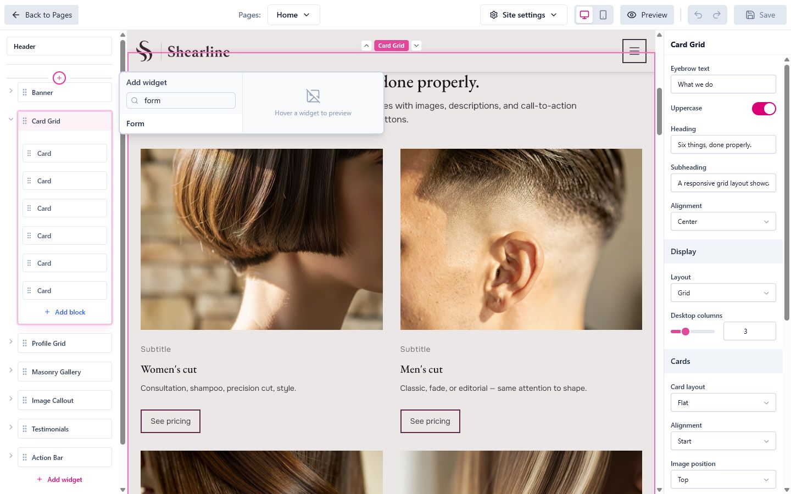

The **Form** widget lets you add a contact or inquiry form to any page. You build the form visually by adding field blocks. Form is a built-in widget, so it's available in most themes.

# Adding a Form

1. In the page editor, add the **Form** widget to your page.
2. Give it a title and (optionally) an eyebrow and description.
3. Add field blocks to build the form (below).
4. Set the submit button label.

<figure class="doc-screenshot">
  
  <figcaption>Search the widget picker for "form" to add the built-in Form widget to a page.</figcaption>
</figure>

# Building the Form

A form is made of **blocks** you add and reorder, just like other widgets:

- **Field:** a single input. Choose its type (such as text, email, or phone), set the label and placeholder, and mark it required if needed.
- **Choice:** a multiple-choice input (dropdown, radio buttons, or checkboxes). Enter the options, one per line.
- **Consent:** a required checkbox for things like privacy-policy agreement.

You can also add sidebar blocks that show next to the form:

- **Info:** a block of formatted text (address, hours, a short note).
- **Social:** links to your social profiles.

Use the widget's **layout** and **appearance** settings (style, sidebar position, color scheme, spacing) to match the form to your design.

# Where Submissions Go

Form submissions work only with the upcoming **commercial version of Widgetizer**, which will be available soon. A static site can't collect submissions on its own, so this is handled by the commercial version rather than by your exported site.

We'll document how submissions are collected here once the commercial version is available.

Of course, you can also embed a form from a third-party service like Google Forms or Typeform. Paste the service's embed code into an embed widget, and that service collects and delivers the responses for you, so it works on any static host today.

# Tips

- Keep forms short: ask only for what you need. Every extra field reduces completions.
- Mark only genuinely required fields as required.
- Always include a clear submit button label ("Send message", "Request a quote").
- Add a **Consent** block if you collect personal data and your region requires explicit agreement.
