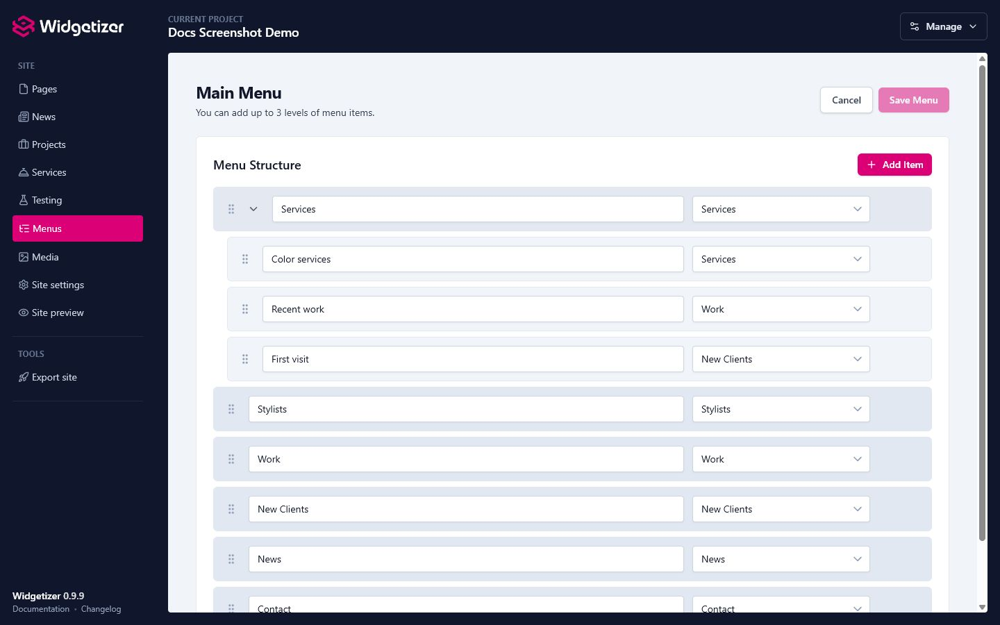

Menus are the navigation systems for your website. You can create multiple menus (for headers, footers, sidebars, etc.) and use them in your theme widgets. Each menu can have a hierarchical structure with dropdown sub-menus.

# Creating a New Menu

1. Click the **"New Menu"** button
2. Fill in the menu details:
   - **Menu Name** (required): e.g., "Main Navigation", "Footer Menu"
   - **Description** (optional): What this menu is for
3. Click **"Create Menu"**

You'll automatically be taken to the structure editor to start adding menu items.

# Adding Menu Items

Once you've created a menu, you can build its structure:

1. Go to the menu's **Structure** page (or click **"Edit Structure"** from the menus list)
2. Click **"Add Menu Item"**
3. Choose the link type and configure it

### Link Types

#### Page or Collection Item Link

Links to one of your website pages. If your theme defines [collections](collections.html) with item pages, you can also link to a specific collection item (a news article, project, service, etc.).

- **Label**: The text shown in the menu (e.g., "About Us")
- **Link to**: Pick a page or collection item from the dropdown

> **Note:** Internal links are stored as stable references. If you later rename the page or item's filename, the menu link follows the change automatically instead of breaking.

#### Custom URL

Links to any URL, internal or external.

- **Label**: The text shown in the menu (e.g., "Google")
- **URL**: The full URL (e.g., `https://google.com` or `/contact`)

# Creating Sub-Menus (Nested Items)

You can create dropdown menus with up to **3 total levels** (including the top-level menu items).

<figure class="doc-screenshot">
  
  <figcaption>The structure editor uses indentation to show which menu items are nested under a parent item.</figcaption>
</figure>

### How to Create a Sub-Menu

1. **Drag and drop** a menu item to the right to nest it under another item
2. The indentation shows which items are children

### Example Structure

```
Home                  (Level 1)
About                 (Level 1)
├── Our Team          (Level 2)
│   └── Leadership    (Level 3 - maximum depth!)
├── History           (Level 2)
Services              (Level 1)
Contact               (Level 1)
```

> **Important:** Widgetizer supports a maximum of **3 levels total**, including the top-level menu items. You cannot nest items deeper than this.

# Reordering Menu Items

Use **drag and drop** to rearrange your menu items:

1. Click and hold on a menu item
2. Drag it up or down to change its position
3. Drag it left or right to change its nesting level
4. Release to drop it in place

The menu automatically saves your changes.

# Editing Menu Items

1. Find the menu item in the structure editor
2. Click the **pencil icon** (Edit)
3. Update the label, page, or URL
4. Click **"Save"**

# Deleting Menu Items

1. Find the menu item in the structure editor
2. Click the **trash icon** (Delete)
3. Confirm the deletion

> **Note:** Deleting a parent item will also delete all its children (sub-menu items).

# Managing Menus

### Editing Menu Settings

To change a menu's name or description:

1. Go to the **Menus** list
2. Click the **pencil icon** (Edit Settings)
3. Update the name or description
4. Click **"Save Changes"**

> **Note:** Changing the menu name will rename the underlying file. For example, "Main Menu" becomes `main-menu.json`.

### Duplicating a Menu

Want to create a similar menu? Click the **copy icon** to duplicate a menu. This creates an exact copy with all menu items and nested structure.

The duplicate will be named "[Original Name] (Copy)", and "(Copy 2)", "(Copy 3)", etc. if a copy already exists.

### Deleting a Menu

1. Go to the **Menus** list
2. Click the **trash icon** (Delete)
3. Confirm the deletion

> **Warning:** Deletion is permanent. All menu items and structure will be removed.

# Using Menus in Your Theme

After creating a menu, you can use it in your theme's header, footer, or any widget. The exact implementation depends on your theme, but typically:

1. Your theme's header or footer widget will have a **menu selector**
2. Choose which menu to display from the dropdown
3. The menu will be rendered with your theme's styling

For theme developers, see [Menus & Snippets](theme-dev-menus-snippets.html) for how to render menus in templates.

# Tips & Best Practices

- Keep the top level short (5-7 items) and group related pages under parents.
- Use the first level for main sections, the second for sub-sections, and the third sparingly.
- Name menus by location, like "Main Navigation" and "Footer Links".
- Always include `https://` on external URLs, and consider opening them in a new tab (check your theme settings).
- Keep labels short and action-oriented ("Get Started", "Contact Us"); avoid "Click Here".
