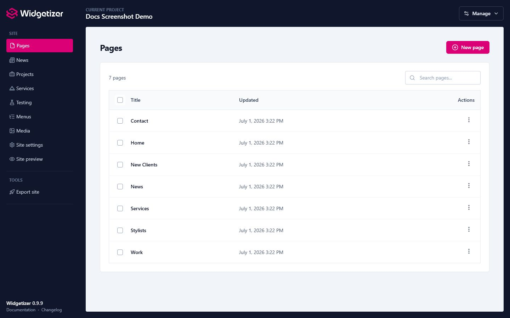

Pages are the individual sections of your website. Each page can have its own content, layout, and SEO settings. You'll use the page editor to add widgets and build your content, but first you need to create the pages themselves.

<figure class="doc-screenshot">
  
  <figcaption>The Pages screen lists every page in the active project and keeps creation, search, and page actions close by.</figcaption>
</figure>

# Creating a New Page

1. Click the **"New Page"** button
2. Fill in the page details (see field explanations below)
3. Click **"Create Page"**

### Page Fields

#### Title

The title shown in the browser tab and search results. This field is required.

#### Filename

The name of the HTML file that will be created when you export your site. For example:

- `index` becomes `index.html` (your homepage)
- `about` becomes `about.html`
- `contact-us` becomes `contact-us.html`

The filename is automatically generated from your page name, but you can edit it.

**Special filenames:**

- **`index`**: This is your homepage. It exports to `index.html`, the file web servers load by default for your domain.

> **Important:** Every project needs a page with the filename `index`. It becomes your homepage, and the site can't be exported without one. If you don't have an `index` page yet, create one or rename an existing page to `index`.

### SEO Settings (Collapsible Section)

Click "More settings" to expand these advanced options:

#### Meta Description

A short summary shown in search results (150-160 characters recommended). This helps people understand what your page is about before clicking.

#### Social Media Title

A custom title used when your page is shared on Facebook, Twitter, and other social platforms. If left empty, the main **Title** field will be used.

This is useful when you want a different, more social-media-friendly title for sharing.

#### Social Media Image

The image shown when someone shares your page on social media (recommended size: 1200x630px).

**To add an image:**

1. Click **"Upload"** or **"Browse"**
2. Choose from your media library or upload a new image
3. You'll see a preview of the selected image

> **Note:** For social media images to work with absolute URLs, make sure you've set a **Site URL** in your [project settings](projects.html).

#### Canonical URL

The preferred URL for this page if it exists elsewhere. This tells search engines which version of a page is the "main" one when you have duplicate or very similar content.

**When to use:**

- If this content exists on another website
- If you have multiple URLs pointing to the same content
- To prevent duplicate content issues in SEO

**Example:** If your page is at both `example.com/about` and `example.com/about-us`, set the canonical URL to your preferred version.

#### Search Engine Indexing

Controls whether search engines can find and index this page, and whether they follow its links.

**Options:**

- **Index and Follow (Default)**: Search engines can index this page and follow its links
- **Don't Index, but Follow Links**: The page won't appear in search results, but link equity still flows through it
- **Index, but Don't Follow Links**: The page can appear in search results, but search engines won't follow its links
- **Don't Index or Follow Links**: Useful for thank you pages, private content, etc.

> When you [export your site](export.html) with a Site URL set, any page whose option starts with "Don't Index" is automatically added to your `robots.txt` file's disallow rules and excluded from `sitemap.xml`.

# Editing a Page

1. Go to the **Pages** list
2. Find your page
3. Click the **pencil icon** (Edit)
4. Update the fields you want to change
5. Click **"Save Changes"**

### Important: Changing the Filename

If you change a page's filename, the file will be renamed automatically when you export. For example:

- Old filename: `about` → `about.html`
- New filename: `about-us` → `about-us.html`

> **Warning:** Renaming a page only affects links from _outside_ your project. Internal links (menu items, rich-text links, and widget link settings) are stored as stable references, so they follow the rename automatically and won't break. What can break are external links to the old URL: search-engine results, links from other websites, and visitors' bookmarks. Once a page is public, rename it with care.

# Deleting Pages

1. Go to the **Pages** list
2. Find the page you want to delete
3. Click the **trash icon** (Delete)
4. Confirm the deletion

### Bulk Delete

You can delete multiple pages at once:

1. Check the boxes next to the pages you want to delete
2. Click **"Delete Selected"**
3. Confirm the deletion

> **Warning:** Deletion is permanent. All content and widgets on the page will be removed.

# Other Page Actions

### Duplicating a Page

Click the **copy icon** to duplicate a page. This creates an exact copy with all widgets and content, but with a new filename (usually the original with `-copy` appended).

# Tips & Best Practices

- Give your homepage the filename `index`; every project needs one.
- Write a unique title (under 60 characters) and meta description (150-160 characters) for each page, and use clear, descriptive filenames.
- Add a 1200x630px social image to important pages, and set a Site URL in your project so social tags use absolute URLs.
- Use a "Don't Index" option for pages you want kept out of search (thank-you, member-only); they're added to `robots.txt` and excluded from `sitemap.xml` on [export](export.html).
- Set a canonical URL when you have duplicate or similar content.
