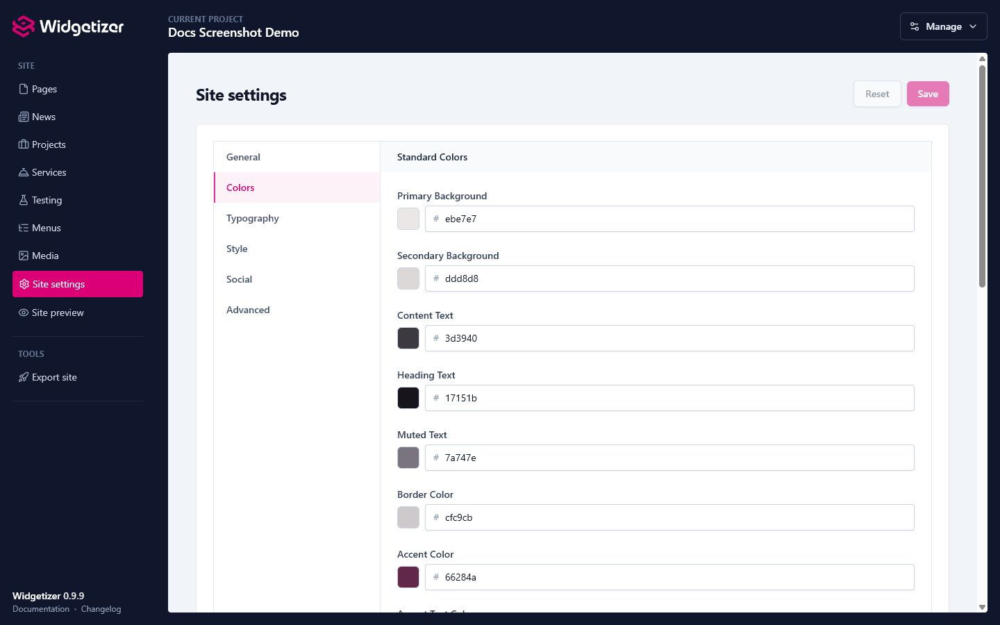

A **Theme** in Widgetizer is a starter kit that provides the foundation for your website. It defines the visual design, layout structure, available widgets, and overall functionality of your site. When you create a new project, you choose a theme that becomes the base for everything you build.

# What is a Theme?

A theme is a complete package that includes:

- **Visual Design**: Colors, typography, spacing, and layout styles
- **Widgets**: Pre-built content components specific to that theme (like hero banners, text sections, galleries, video popups, etc.)
- **Layout Templates**: The HTML structure that wraps your content
- **Global Settings**: Theme-wide customization options (colors, fonts, etc.)
- **Collections** _(some themes)_: Content types like News or Projects that you fill with items (see [Collections](collections.html))

Think of a theme as a design system and component library rolled into one. It provides you with a set of building blocks (widgets) that are designed to work together cohesively.

# Why Themes Cannot Be Changed

Once you create a project with a theme, **you cannot change the theme** for that project. Your pages are built from that theme's widgets, and every widget is wired to the theme's own settings, CSS, and HTML. Swapping the theme underneath would leave those widgets with nowhere to render, breaking your layouts and content.

Widgetizer is built for small sites, which almost always start from a clear design direction, so there's rarely a need to switch mid-project. And because each theme's customization options are extensive (colors, typography, widget settings, and layout), you can take a site a long way without ever changing themes. Locking the theme at creation keeps the experience simple and predictable.

If a different design is what you're after, starting a fresh project is faster and cleaner than migrating content between incompatible themes.

# Theme Updates

Widgetizer includes a theme update system that allows theme authors to release improvements, and you can apply those updates to your projects while keeping your content safe.

### How Theme Updates Work

When a theme author releases an update:

1. **Notification**: The sidebar shows a badge indicating themes have updates available
2. **Theme Page**: Visit the Themes page to see which themes have updates
3. **Update**: Click **"Update"** on a theme card to install the latest version
4. **Apply to Projects**: Projects using that theme will show an update indicator

### Applying Updates to Your Projects

After a theme is updated:

1. Go to the **Projects** page
2. Look for the **update indicator** (arrow icon) next to projects using the updated theme
3. Edit the project and click **"Apply Theme Update"**
4. The system updates your project's theme files while preserving your content

### What Gets Updated

Theme updates can include:

- **Layout template** (`layout.liquid`) - Replaced with new version
- **Widgets** - Entire widget folder replaced with new versions
- **Assets** (CSS, JS) - Replaced with new versions
- **Snippets** - Replaced with new versions
- **Locales** (translation JSON files) - Replaced with new versions
- **Theme screenshot** - Replaced with new version
- **Theme settings schema** - New settings are added, your existing values are preserved

### What's Protected (Never Changed)

Your content is always safe:

- **Pages** - Your page content is never modified
- **Media** - Your uploaded images and PDFs are preserved
- **Menus** - Existing menus are kept (new menus may be added)
- **Templates** - Existing page templates are kept (new templates may be added)

### Settings Merge

When a theme update includes new settings:

- **New settings** are added with their default values
- **Your customized values** (colors, fonts, etc.) are preserved
- **Removed settings** (deleted by theme author) are cleaned up

This means your design choices stay intact while you get access to new features.

> **Note:** Theme updates improve your existing theme; they don't change it to a different design system. Your content always remains compatible.

# Deleting a Theme

You can remove a theme you no longer need from the Themes page:

1. Open the **three-dot menu** (⋮) on the theme card.
2. Choose **Delete**.
3. Confirm in the dialog. Deletion cannot be undone.

**Restriction:** You cannot delete a theme that is currently used by any project. If you try, Widgetizer shows an error explaining that the theme is in use. Remove or change the theme from those projects first (e.g. by deleting the projects or switching them to another theme), then delete the theme.

# Theme Presets

Some themes offer **presets**: named variants that provide different color schemes, typography, and optionally different demo content (pages, menus, and global widgets). Presets let a single theme serve multiple use cases without duplicating the entire theme.

When you select a theme with presets during [project creation](projects.html), a visual card grid appears showing each preset's preview, name, and description. Pick the one that best fits your needs. The default preset is pre-selected.

**Key points:**

- Presets are applied only at project creation time
- Once created, your project is independent; you can freely customize all settings
- A "settings-only" preset changes colors and fonts but keeps the same demo pages
- A "full" preset can provide completely different demo pages, menus, and navigation
- Themes without presets work exactly the same as before

# Choosing a Theme

When creating a new project, consider:

- **Design Style**: Does the theme match the aesthetic you want for your site?
- **Presets**: Does the theme offer preset variants that match your use case?
- **Widgets**: Does the theme include the types of widgets you need (galleries, testimonials, etc.)?
- **Flexibility**: Does the theme offer enough customization options for your needs?
- **Purpose**: Is the theme designed for your type of site (portfolio, blog, business, etc.)?

Once you've chosen a theme (and optionally a preset) and created your project, you can customize it using the theme's global settings (colors, typography, etc.) and build your pages using the theme's widgets.

# Customization Within a Theme

While you can't change themes, you have significant customization options within your chosen theme:

- **Global Settings**: Customize colors, fonts, and other theme-wide settings
- **Widget Settings**: Each widget has its own settings for content, layout, and styling
- **Content**: Add, remove, and rearrange widgets and blocks to create your desired layout
- **Media**: Upload and use your own images

<figure class="doc-screenshot">
  
  <figcaption>Theme settings expose the global controls the theme author has made customizable, such as colors and typography.</figcaption>
</figure>

These customization options allow you to create a unique website while staying within your theme's design system.

# Creating Your Own Theme

If you're a developer and want to create custom themes, see the [Theme Development](theme-dev-structure.html) documentation.
